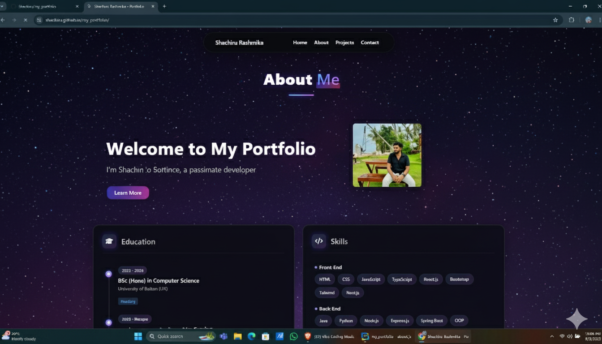

# My Portfolio



## 👋 Welcome to My Portfolio

This repository contains my professional portfolio showcasing my projects, skills, and experience as a developer. Feel free to explore my work and reach out if you'd like to collaborate.

## 📋 Table of Contents

- [Overview](#overview)
- [Projects](#projects)
- [Skills](#skills)
- [Education](#education)
- [Experience](#experience)
- [Contact](#contact)

## 🔭 Overview

This portfolio demonstrates my journey as a developer, highlighting my technical skills, problem-solving abilities, and creative solutions. Each project represents different aspects of my capabilities and areas of interest.

## 💻 Projects

### Project 1: [Project Name]
- **Description**: Brief description of the project
- **Technologies**: List of technologies used
- **Demo**: [Live Demo](https://demo-link.com)
- **Repository**: [GitHub Repo](https://github.com/Shachiru/project-repo)

### Project 2: [Project Name]
- **Description**: Brief description of the project
- **Technologies**: List of technologies used
- **Demo**: [Live Demo](https://demo-link.com)
- **Repository**: [GitHub Repo](https://github.com/Shachiru/project-repo)

### Project 3: [Project Name]
- **Description**: Brief description of the project
- **Technologies**: List of technologies used
- **Demo**: [Live Demo](https://demo-link.com)
- **Repository**: [GitHub Repo](https://github.com/Shachiru/project-repo)

## 🛠️ Skills

### Programming Languages
- Language 1
- Language 2
- Language 3

### Frameworks & Libraries
- Framework 1
- Framework 2
- Library 1

### Tools & Technologies
- Tool 1
- Tool 2
- Technology 1

## 🎓 Education

### [Degree] | [University/Institution]
- **Period**: YYYY - YYYY
- **Relevant Coursework**: Course 1, Course 2, Course 3
- **Achievements**: Notable achievements or honors

## 💼 Experience

### [Job Title] | [Company]
- **Period**: MM/YYYY - MM/YYYY
- **Responsibilities**:
  - Responsibility 1
  - Responsibility 2
  - Responsibility 3
- **Achievements**: Notable achievements or contributions

## 📞 Contact

- **Email**: your.email@example.com
- **LinkedIn**: [Your LinkedIn](https://linkedin.com/in/yourprofile)
- **Twitter**: [@YourTwitter](https://twitter.com/yourhandle)
- **Personal Website**: [your-website.com](https://your-website.com)

## 🚀 How to Run This Portfolio Locally

1. Clone this repository
   ```
   git clone https://github.com/Shachiru/my_portfolio.git
   ```
2. Navigate to the project directory
   ```
   cd my_portfolio
   ```
3. [Add any additional steps required to run your portfolio locally]

## 📄 License

This project is licensed under the [Your License] License - see the [LICENSE](LICENSE) file for details.

---

© 2025 [Your Name] | All Rights Reserved
